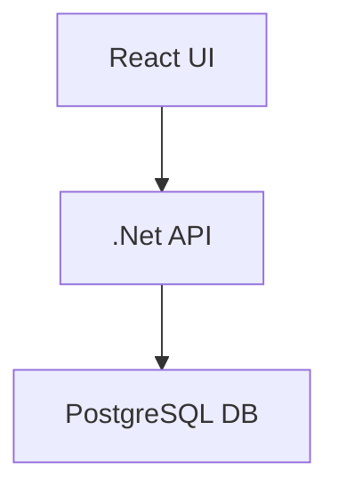
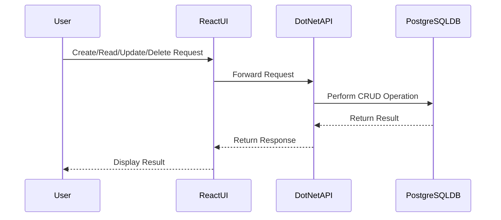

# CashCaddy
 simple expense tracker written in React-TS and .Net with postgres

## architecture

```mermaid
graph TD
    A[React UI] --> B[.Net API]
    B --> C[PostgreSQL DB]
```

## sequence

```mermaid
sequenceDiagram
    participant User
    participant ReactUI
    participant DotNetAPI
    participant PostgreSQLDB

    User->>ReactUI: Create/Read/Update/Delete Request
    ReactUI->>DotNetAPI: Forward Request
    DotNetAPI->>PostgreSQLDB: Perform CRUD Operation
    PostgreSQLDB-->>DotNetAPI: Return Result
    DotNetAPI-->>ReactUI: Return Response
    ReactUI-->>User: Display Result
```